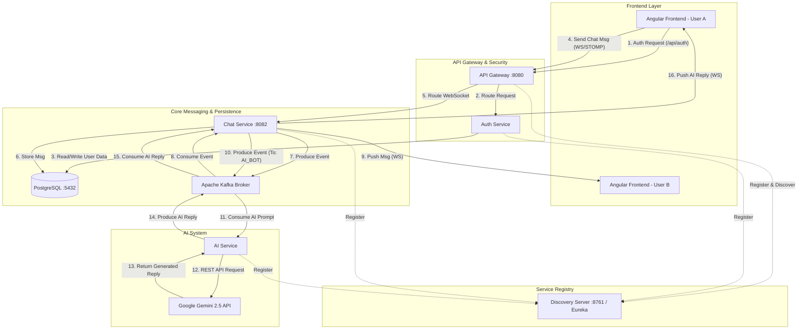

# 🗨️ Real-Time Distributed Chat Application

A high-concurrency, event-driven chat platform built with **Microservices**, **Spring Boot**, **Apache Kafka**, **Angular**, and **Google Gemini AI**.


## 🚀 Overview

This project implements a scalable messaging system where the frontend (Angular) and backend (Spring Boot) are fully decoupled. It uses **WebSockets (STOMP)** for real-time delivery and **Apache Kafka** as a distributed message broker to handle high throughput and ensure message durability.

It features a custom **AI Service** that acts as a "Ghost User" (`AI_BOT`) in the chat, listening to messages and replying using Google's generative models.

### ✨ Key Features
*   **Real-Time Messaging**: Instant delivery using WebSocket & SockJS.
*   **Event-Driven Architecture**: Uses Kafka to buffer and route messages asynchronously.
*   **AI Chatbot**:
    *   **Intelligent Replies**: Powered by **Google Gemini 2.5 Flash**.
    *   **Resilient Fallback**: gracefully handles offline states or quota limits.
*   **Microservices**:
    *   **Auth Service**: JWT-based identity management (Access/Refresh Tokens).
    *   **Chat Service**: Core messaging logic and persistence.
    *   **AI Service**: Smart chatbot integration (`AI_BOT`).
    *   **API Gateway**: Centralized routing and load balancing.
    *   **Discovery Server**: Eureka-based service registry.
*   **Security**:
    *   **Strict Session Isolation**: New tabs require fresh login (`sessionStorage`).
    *   **Auto-Logout**: Automatically terminates session after 5 minutes of inactivity.
    *   **Route Guards**: Angular AuthGuard protects private routes.
*   **Modern UI**: Built with Angular Material, featuring toast notifications, auto-scroll, and responsive layout.

---

## 🏗️ Architecture



---

## 🛠️ Tech Stack

*   **Backend**: Java 17, Spring Boot 3, Spring Cloud (Gateway, Eureka)
*   **Frontend**: Angular 17, Angular Material, RxJS
*   **Messaging**: Apache Kafka, Zookeeper, STOMP, SockJS
*   **AI**: Google Gemini API (Model: `gemini-2.5-flash`)
*   **Database**: PostgreSQL
*   **Infrastructure**: Docker, Docker Compose

---

## ⚡ Getting Started

### Prerequisites
*   Docker Desktop (Running)
*   Java 17+
*   Node.js (LTS) & Angular CLI

### 1. Start Infrastructure
We provide a unified startup script for convenience:
```bash
./run-app.bat
```
*(This command launches Kafka, Eureka, Gateway, Auth, Chat, AI Service, and Frontend in separate terminals)*

**Alternative (Manual Start):**
```bash
# Infrastructure
docker-compose up -d

# Microservices (Run in separate terminals)
cd discovery-server && mvn spring-boot:run
cd api-gateway && mvn spring-boot:run
cd auth-service && mvn spring-boot:run
cd chat-service && mvn spring-boot:run
cd ai-service && mvn spring-boot:run

# Frontend
cd chat-frontend
npm install
ng serve
```

### 2. Access Application
Open your browser at **http://localhost:4200**.

---

## 📖 Usage Guide

1.  **Register**: Create a new account (e.g., `user1`).
2.  **Login**: Access the dashboard.
3.  **Chat**:
    *   **Human-to-Human**: Open an Incognito window, login as `user2`, and message `user1`.
    *   **AI-to-Human**: Send a message to the recipient **`AI_BOT`**. The AI will reply instantly!

---

## 🔧 Troubleshooting

*   **AI Not Replying?**: Check the `ai-service` terminal logs. If you see a `429` error, you can verify your API Key in `ai-service/src/main/resources/application.yml`.
*   **Kafka Exit Code 1**: Ensure you are using the pinned version `7.4.0` in `docker-compose.yml`.
*   **CORS Errors**: Verify API Gateway is running on port `8080`.
*   **Login Issues**: Clear your browser's `sessionStorage` if stuck.

---

## 👤 Author

Developed as a demonstration of robust Microservices Architecture.
