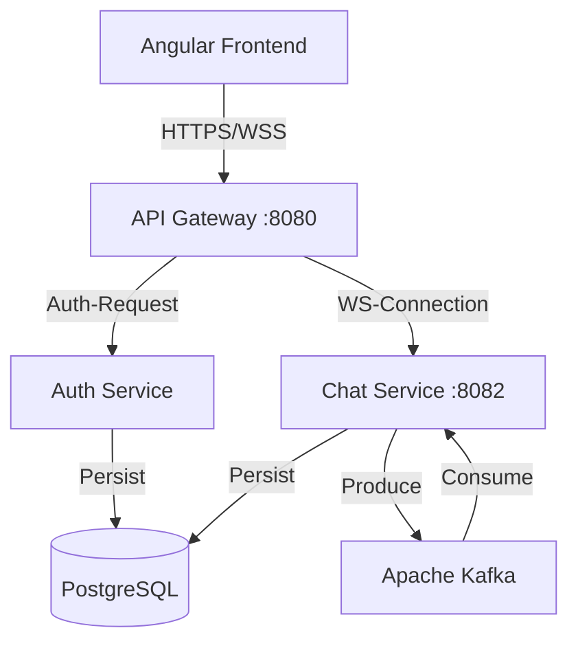

# 🗨️ Real-Time Distributed Chat Application

A high-concurrency, event-driven chat platform built with **Microservices**, **Spring Boot**, **Apache Kafka**, and **Angular**.


## 🚀 Overview

This project implements a scalable messaging system where the frontend (Angular) and backend (Spring Boot) are fully decoupled. It uses **WebSockets (STOMP)** for real-time delivery and **Apache Kafka** as a distributed message broker to handle high throughput and ensure message durability.

### ✨ Key Features
*   **Real-Time Messaging**: Instant delivery using WebSocket & SockJS.
*   **Event-Driven Architecture**: Uses Kafka to buffer and route messages asynchronously.
*   **Microservices**:
    *   **Auth Service**: JWT-based identity management (Access/Refresh Tokens).
    *   **Chat Service**: Core messaging logic and persistence.
    *   **API Gateway**: Centralized routing and load balancing.
    *   **Discovery Server**: Eureka-based service registry.
*   **Security**:
    *   **Strict Session Isolation**: New tabs require fresh login (`sessionStorage`).
    *   **Auto-Logout**: Automatically terminates session after 5 minutes of inactivity.
    *   **Route Guards**: Angular AuthGuard protects private routes.
*   **Modern UI**: Built with Angular Material, featuring toast notifications, auto-scroll, and responsive layout.

---

## 🏗️ Architecture



---

## 🛠️ Tech Stack

*   **Backend**: Java 17, Spring Boot 3, Spring Cloud (Gateway, Eureka)
*   **Frontend**: Angular 17, Angular Material, RxJS
*   **Messaging**: Apache Kafka, Zookeeper, STOMP, SockJS
*   **Database**: PostgreSQL
*   **Infrastructure**: Docker, Docker Compose

---

## ⚡ Getting Started

### Prerequisites
*   Docker Desktop (Running)
*   Java 17+
*   Node.js (LTS) & Angular CLI

### 1. Start Infrastructure
Run the database and message broker containers:
```bash
docker-compose up -d
```
> **Verify**: Run `docker ps` to ensure `chat-kafka`, `chat-zookeeper`, and `chat-postgres` are healthy.

### 2. Start Microservices
Run these in separate terminals:
```bash
# 1. Discovery Server
cd discovery-server && mvn spring-boot:run

# 2. API Gateway
cd api-gateway && mvn spring-boot:run

# 3. Auth Service
cd auth-service && mvn spring-boot:run

# 4. Chat Service
cd chat-service && mvn spring-boot:run
```

### 3. Start Frontend
```bash
cd chat-frontend
npm install
ng serve
```
Open your browser at **http://localhost:4200**.

---

## 📖 Usage Guide

1.  **Register**: Create a new account (e.g., `user1`).
2.  **Login**: Access the dashboard.
3.  **Chat**:
    *   Open a second browser window (Incognito).
    *   Login as `user2`.
    *   Type `user1` in the recipient box and hit enter.
    *   Send a message! 🚀

---

## 🔧 Troubleshooting

*   **Kafka Exit Code 1**: Ensure you are using the pinned version `7.4.0` in `docker-compose.yml`.
*   **CORS Errors**: Verify API Gateway is running on port `8080`.
*   **Login Issues**: Clear your browser's `sessionStorage` if stuck.

---

## 👤 Author

Developed as a demonstration of robust Microservices Architecture.
